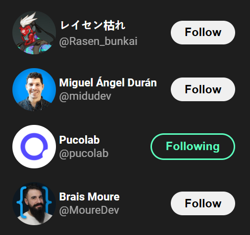

# Learning React

Este proyecto está diseñado para aprender React, una biblioteca de JavaScript para construir interfaces de usuario.
A través de este ejemplo se realizo un clon del componente de X (antes twitter) "Who to follow".